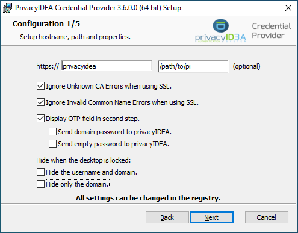

# Privacyidea Kurulumu Microsoft RDP ve OpenVPN Entegrasyonu
Bu makalede, PrivacyIDEA ve OpenVPN kullanarak iki faktörlü kimlik doğrulama (2FA) sistemi kurulumunun adımlarını ele alıyoruz.

Linux dağıtımı olarak Ubuntu 24.04.1 kullanılmıştır.

### PrivacyIDEA Kurulumu

#### Zaman Dilimi Ayarı

Zaman dilimini ayarlayın:
```bash
sudo timedatectl set-timezone Europe/Istanbul
```

#### Gerekli Paketlerin Yüklenmesi

1. Python ve Virtualenv kurulumu:
```bash
sudo apt install python3-pip
sudo pip install virtualenv --break-system-packages
```

2. PrivacyIDEA ortamını oluştur:
```bash
sudo virtualenv -p /usr/bin/python3 /opt/privacyidea
cd /opt/privacyidea
source bin/activate
```

3. PrivacyIDEA paketlerini yükleyin:
```bash
sudo pip install privacyidea --break-system-packages
sudo chown -R $(whoami) /opt/privacyidea/
```

4. GPG anahtarını indirip ekleyin:
```bash
wget https://lancelot.netknights.it/NetKnights-Release.asc
sudo mv NetKnights-Release.asc /etc/apt/trusted.gpg.d/
sudo add-apt-repository http://lancelot.netknights.it/community/noble/stable
sudo apt update
sudo apt install privacyidea-apache2
```

#### Web Arayüz Ayarları

1. Admin kullanıcısı oluşturun:
```bash
sudo pi-manage admin add admin admin@localhost
```

2. Arayüz dilini ayarlamak için dosyayı düzenleyin:
```bash
sudo nano /opt/privacyidea/lib/python3.12/site-packages/privacyidea/webui/login.py
```

Sadece İngilizce dilini aktif edin:
```python
# DEFAULT_LANGUAGE_LIST = ['en', 'de', 'nl', 'zh Hant', 'fr', 'es', 'tr', 'cs', 'it']  #:
DEFAULT_LANGUAGE_LIST = ['en']  #:
```

3. Apache sunucusunu yeniden başlatın:
```bash
sudo systemctl restart apache2
```

#### MySQL Veritabanı Kurulumu

1. MySQL üzerinde veritabanı oluşturun:
```sql
CREATE DATABASE rdp_users CHARACTER SET utf8mb4 COLLATE utf8mb4_general_ci;
USE rdp_users;
GRANT ALL PRIVILEGES ON rdp_users.* TO 'pi'@'localhost';
FLUSH PRIVILEGES;
```

2. Kullanıcı tablosunu ekleyin:
```sql
CREATE TABLE users (
  id INT AUTO_INCREMENT PRIMARY KEY,
  username VARCHAR(255) NOT NULL UNIQUE,
  firstname VARCHAR(255),
  lastname VARCHAR(255),
  email VARCHAR(255),
  mobile VARCHAR(20),
  description TEXT,
  enabled BOOLEAN DEFAULT TRUE,
  created_at TIMESTAMP DEFAULT CURRENT_TIMESTAMP,
  updated_at TIMESTAMP DEFAULT CURRENT_TIMESTAMP ON UPDATE CURRENT_TIMESTAMP
);
```

3. MYSQL tarafında erişim için kullanacağımız kullanıcı bilgilerini aşağıdaki dosyadan alın.
```bash
sudo nano /etc/privacyidea/pi.cfg
```

#### PrivacyIDEA Web Arayüz Ayarları

1. Yeni bir SQL Resolver tanımlayın:
   - Resolver Name: `mysql-resolver`
   - Driver: `mysql-pymysql`
   - Server: `127.0.0.1`
   - Port: `3306`
   - Database: `rdp_users`
   - User: `pi`
   - Password: `EnQaAwbrs2iP`
   - Mapping: `{ "username": "username", "surname": "lastname", "givenname": "firstname", "email": "email", "mobile": "mobile", "description": "description", "userid": "id" }`

2. Yeni bir realm oluşturun ve default olarak ayarlayın.

3. Users bölümünden kullanıcıyı kaydedin.
4. Tokens bölümüne gelin. Enroll token bölümünden TOTP yi seçin.
5. Realm olarak yeni oluştuğunuz realm i seçin.
6. Username olarak mysql üzerinde oluşturduğunuz ismi girin.
7. Pin kısmını boş geçin.
8. Assign the token to a container bölümünden container ayarlayabilirsin.
9. Enroll Token diyerek tokeni kullanıcıya atayın.
10.RDP Yapacağınız sunucu üzerinde de aynı isimde bir kullanıcı tanımlayın.
11. Not : Kurulum Windows 2022 üzerinde gerçekleştirilmiştir.
12. Kurulum aşamalarını aşağıdaki resimlere bakarak tamamlayın.





---

Bu adımları tamamladıktan sonra, sisteminiz PrivacyIDEA ve RDP ile iki faktörlü kimlik doğrulama desteğiyle daha güvenli hale gelecektir.

---

### OpenVPN Tarafında 2FA Kurulumu

#### OpenVPN Kurulumu

1. Zaman dilimini ayarlayın:
```bash
sudo timedatectl set-timezone Europe/Istanbul
```

2. OpenVPN kurulumu:
```bash
wget https://raw.githubusercontent.com/angristan/openvpn-install/refs/heads/master/openvpn-install.sh
chmod +x openvpn-install.sh
sudo ./openvpn-install.sh
```

3. Linux sunucu üzerinde yeni bir kullanıcı ekleyin:
```bash
sudo adduser gokhan
```

4. Oluşturduğunuz kullanıcıyı OpenVPN üzerinden bağlanabilmesi için ekleyin:
```bash
sudo ./openvpn-install.sh
- Clientname: `gokhan`
- Password: `Add a passwordless client`
```

#### PrivacyIDEA ile PAM Entegrasyonu

1. PrivacyIDEA PAM modülünü kurun:
```bash
git clone https://github.com/privacyidea/privacyidea-pam
cd privacyidea-pam
wget https://github.com/nlohmann/json/releases/download/v3.11.3/json.hpp
sudo apt install make g++ libcurl4-openssl-dev libssl-dev libpam0g-dev
make
make install
sudo mkdir /lib64/security/
sudo mv pam_privacyidea.so /lib64/security
```

2. PAM dosyasını düzenleyin:
```bash
sudo nano /etc/pam.d/openvpn
```
Dosyanın içeriği:
```plaintext
auth    required                        pam_unix.so     try_first_pass
auth    [success=1 default=die]         /lib64/security/pam_privacyidea.so      url=https://domainadiniz.org prompt=privacyIDEA_Authentication
auth    requisite                       pam_deny.so
auth    required                        pam_permit.so
account sufficient                      pam_permit.so
session sufficient                      pam_permit.so
```

3. OpenVPN sunucu ayar dosyasını düzenleyin:
```bash
sudo nano /etc/openvpn/server.conf
```
Ayarlar:
```plaintext
verify-client-cert none
username-as-common-name
reneg-sec 0
plugin /usr/lib/x86_64-linux-gnu/openvpn/plugins/openvpn-plugin-auth-pam.so "openvpn login USERNAME password PASSWORD 'please enter otp:' OTP"
script-security 3
```

4. OpenVPN sunucusunu yeniden başlatın:
```bash
sudo systemctl restart openvpn@server.service
```

5. OpenVPN istemci ayar dosyasına aşağıdaki satırları ekleyin:
```bash
auth-user-pass
static-challenge "privacyIDEA_Authentication" 1
setenv FRIENDLY_NAME "privacyIDEA_Authentication"
```

---

Bu adımları tamamladıktan sonra, sisteminiz PrivacyIDEA ve OpenVPN ile iki faktörlü kimlik doğrulama desteğiyle daha güvenli hale gelecektir.

